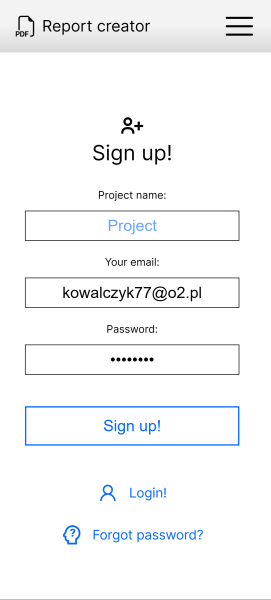
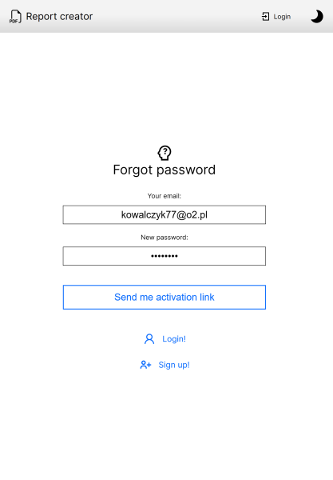
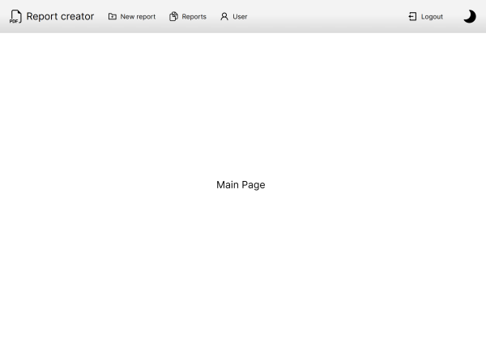
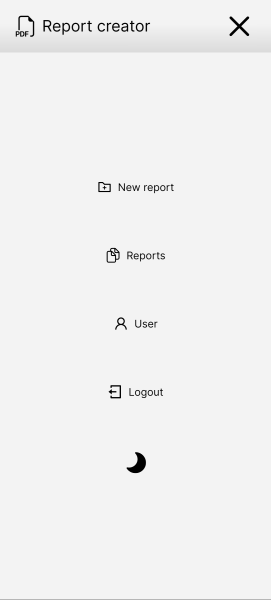
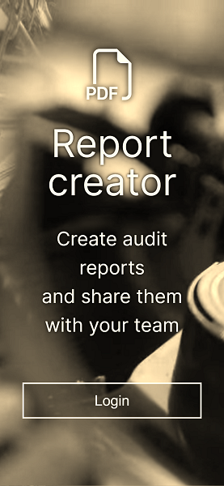

# PDF-Reports (Starter template)

Learning to merge NEXT.js, Typescript, SASS, Redux, MongoDB, NEXT-AUTH, NEXT-CONNECT, NEXT-PWA, and more.

Project template with authentication, authorization, CRUD operations, testing and minimal frontend.

Demo: https://reports.webdev.priv.pl/

To login use:
- project: Trans 
- email: kowalczyk77@o2.pl
- password: test1234

My git repo: https://github.com/Raff1010X/01.Roadmap

##

