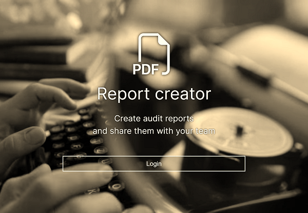
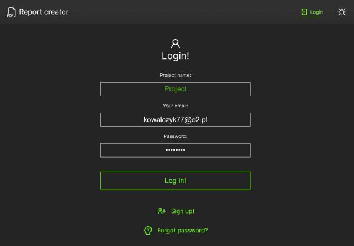

# PDF-Reports (Starter temlate)

Demo: https://reports.webdev.priv.pl/

To login use:
- project: Trans 
- email: kowalczyk77@o2.pl
- password: test1234

My git repo: https://github.com/Raff1010X/01.Roadmap

## Technologie
Typescript, NEXT.JS, SASS, React, Redux, Redux-Thunk, MONGO, NEXT-AUTH, NEXT-CONNECT...

##

